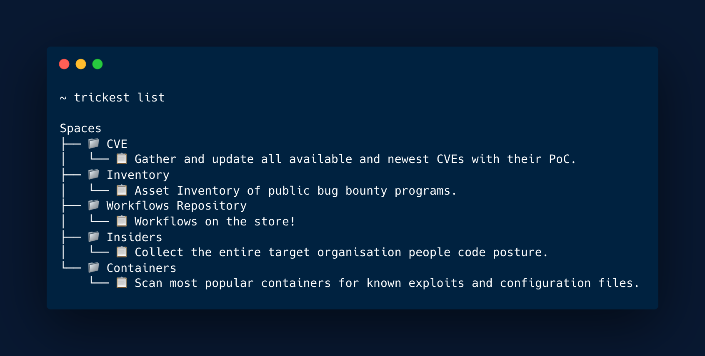
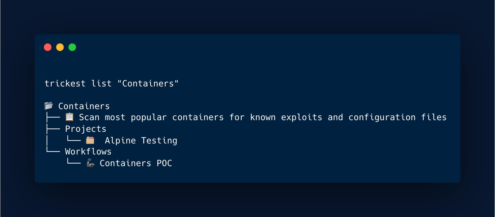
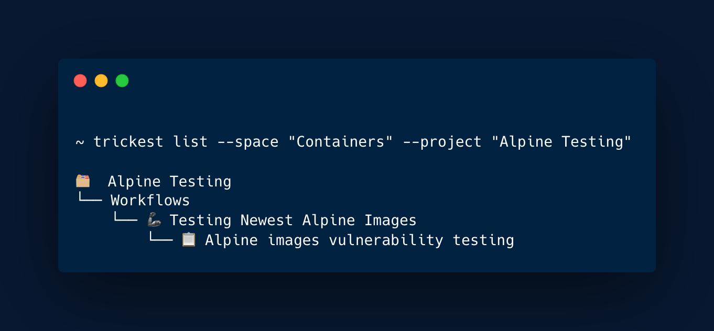
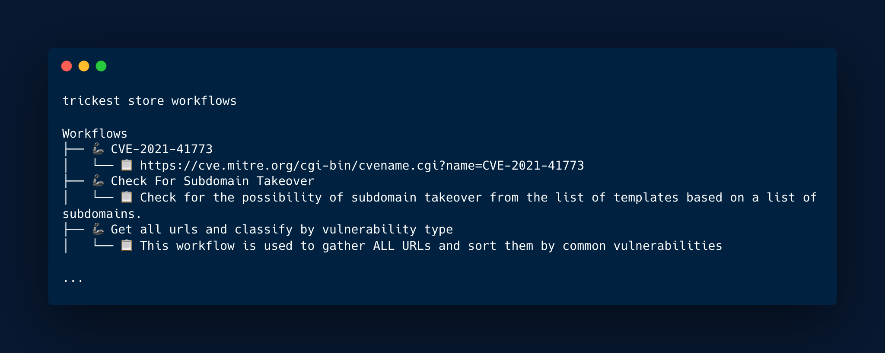
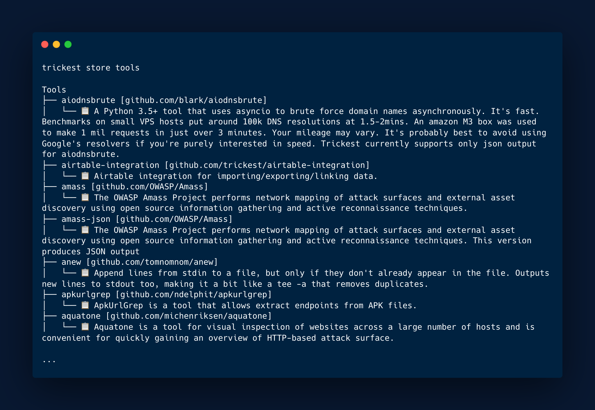

<h1 align="center">Trickest Client<a href="#"> </a></h1>

<h3 align="center">
Client used for executing, listing, downloading, getting, creating, deleting and searching objects on the <a href=https://trickest.com>Trickest</a> platform.
</h3>

# About

Trickest platform is an IDE tailored for bug bounty hunters, penetration testers, and SecOps teams to build and automate workflows from start to finish. Powered by the world's most advanced crowdsourced intelligence.

Current workflow categories:

- Containers
- Scraping
- Probing
- Spidering
- CVE
- Machine Learning
- Social Engineering
- Cloud Storage
- Static Code Analysis
- Vulnerabilities
- Utilities
- Static
- Social
- Scanners
- Recon
- Passwords
- Network
- Misconfiguration
- Fuzzing
- Discovery
  
# Install

## Quickstart

#### **OSX**

```
# Download the binary
curl -sLO https://github.com/trickest/trickest-cli/releases/download/v1.0/trickest-cli-darwin-amd64.gz

# Unzip
gunzip trickest-cli-darwin-amd64.gz

# Make binary executable
chmod +x trickest-cli-darwin-amd64

# Move binary to path
mv ./trickest-cli-darwin-amd64 /usr/local/bin/trickest

# Test installation
trickest version
```

#### **Linux**

```
# Download the binary
curl -sLO https://github.com/trickest/trickest-cli/releases/download/v1.0/trickest-cli-linux-amd64.gz

# Unzip
gunzip trickest-cli-linux-amd64.gz

# Make binary executable
chmod +x trickest-cli-linux-amd64

# Move binary to path
mv ./trickest-cli-linux-amd64 /usr/local/bin/trickest

# Test installation
trickest version
```

# Usage

## Authentication

### Token

You can find your token on [my-account page](https://trickest.io/dashboard/settings/my-account) inside the Trickest platform.

It can be supplied as a flag `--token` or an environment variable `TRICKEST_TOKEN`. 

### Dynamics

The `TRICKEST_TOKEN` supplied as a flag will be checked **first** and take priority if both are present.

## List

### All

`trickest list` will list all of your created spaces & projects and their descriptions.



### Spaces

`trickest list "<SPACE_NAME>"` or ```trickest list --space "<SPACE_NAME>"``` will list the content of space along with its projects and workflows.



### Projects   


`trickest list "<SPACE_NAME>/<PROJECT_NAME>"` or ```trickest list --space "<SPACE_NAME>" --project "<PROJECT_NAME>"``` will list all workflows in the project supplied.



Keep in mind that when passing values that have spaces they need be inside of double quotes (eg. "Alpine Testing")

## Create

### Space

`trickest create "<SPACE_NAME>"` or `trickest create --space "<SPACE_NAME>"` will create new space.

### Project

`trickest create "<SPACE_NAME>/<PROJECT_NAME>"` or `trickest create --space "<SPACE_NAME>" --project "<PROJECT_NAME>"`  will create new space and project.

### Workflow   


`trickest create "<SPACE_NAME>/<PROJECT_NAME>/<WORKFLOW_NAME>"` or ```trickest create --space "<SPACE_NAME>" --project "<PROJECT_NAME>" --workflow "<WORKFLOW_NAME>"``` will list all workflows in the project supplied.

## Delete

### Space

`trickest delete "<SPACE_NAME>"` or `trickest delete --space "<SPACE_NAME>"` will delete supplied space.

### Project

`trickest delete "<SPACE_NAME>/<PROJECT_NAME>"` or `trickest delete --space "<SPACE_NAME>" --project "<PROJECT_NAME>"`  will delete the space and project supplied

### Workflow   


`trickest delete "<SPACE_NAME>/<PROJECT_NAME>/<WORKFLOW_NAME>"` or ```trickest delete --space "<SPACE_NAME>" --project "<PROJECT_NAME>" --workflow "<WORKFLOW_NAME>"``` will delete workflow in the project and/or space supplied.

## Store

### Platform

[Trickest Store](https://trickest.io/dashboard/store) is a collection of all workflows, tools and scripts available on the platform. 

If you are interested in contributing, viewing and executing the workflows and the tools with the `trickest-cli` you can check also our [workflows repository.](https://github.com/trickest/workflows)

#### Workflows

`trickest store workflows` will list all of public workflows available on the store.



#### Tools

`trickest store tools` will list all of public tools available on the store.

