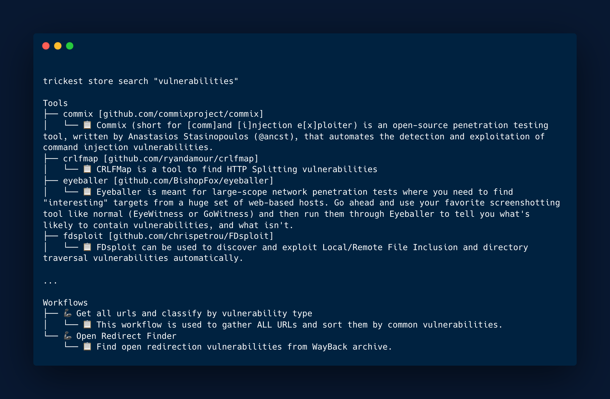
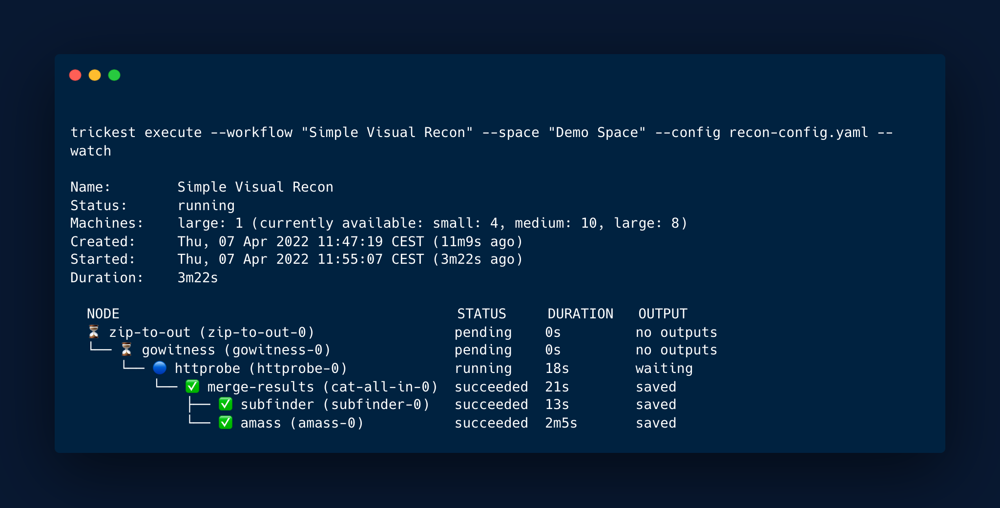
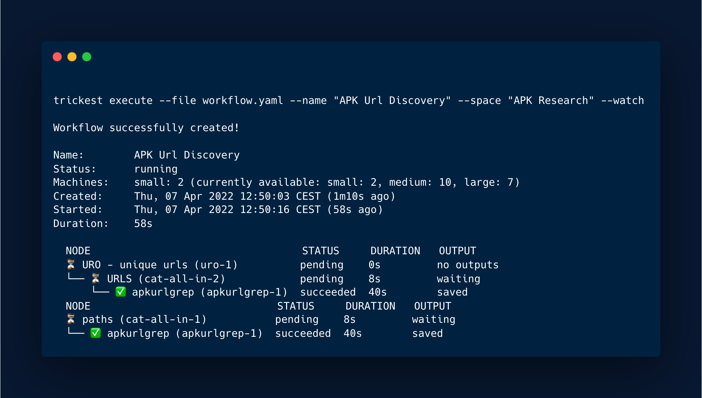
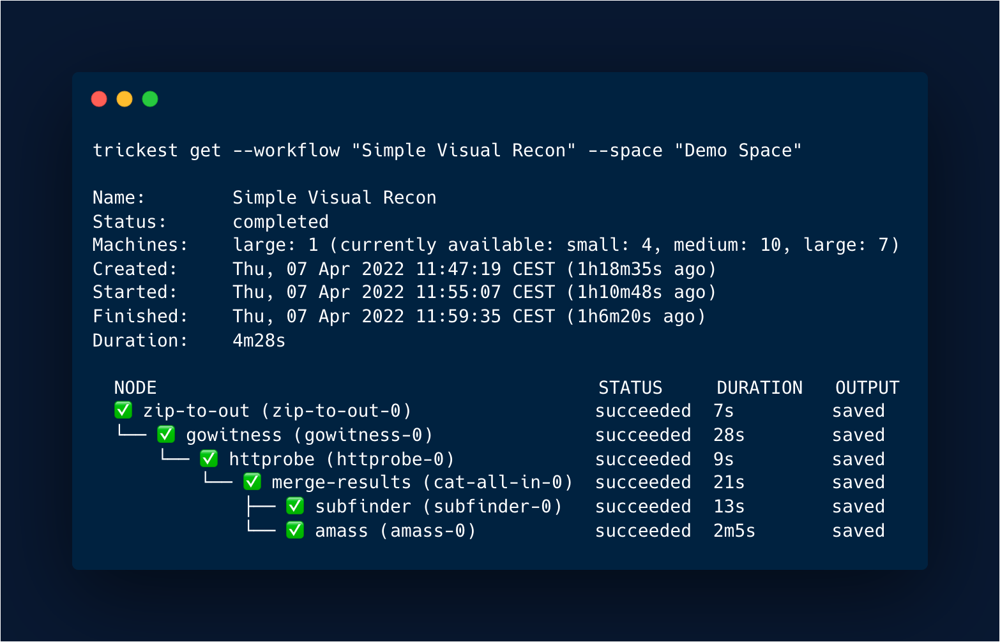

<h1 align="center">Trickest Client<a href="#"> </a></h1>

<h3 align="center">
Client used for executing, listing, downloading, getting, creating, deleting and searching objects on the <a href=https://trickest.com>Trickest</a> platform.
</h3>

# About

Trickest platform is an IDE tailored for bug bounty hunters, penetration testers, and SecOps teams to build and automate workflows from start to finish. Powered by the world's most advanced crowdsourced intelligence.

Current workflow categories:

- Containers
- Scraping
- Probing
- Spidering
- CVE
- Machine Learning
- Social Engineering
- Cloud Storage
- Static Code Analysis
- Vulnerabilities
- Utilities
- Static
- Social
- Scanners
- Recon
- Passwords
- Network
- Misconfiguration
- Fuzzing
- Discovery
  
# Install

## Quickstart

#### **OSX**

```
# Download the binary
curl -sLO https://github.com/trickest/trickest-cli/releases/download/v1.0/trickest-cli-darwin-amd64.gz

# Unzip
gunzip trickest-cli-darwin-amd64.gz

# Make binary executable
chmod +x trickest-cli-darwin-amd64

# Move binary to path
mv ./trickest-cli-darwin-amd64 /usr/local/bin/trickest

# Test installation
trickest version
```

#### **Linux**

```
# Download the binary
curl -sLO https://github.com/trickest/trickest-cli/releases/download/v1.0/trickest-cli-linux-amd64.gz

# Unzip
gunzip trickest-cli-linux-amd64.gz

# Make binary executable
chmod +x trickest-cli-linux-amd64

# Move binary to path
mv ./trickest-cli-linux-amd64 /usr/local/bin/trickest

# Test installation
trickest version
```

# Usage

## Authentication

### Token

You can find your token on [my-account page](https://trickest.io/dashboard/settings/my-account) inside the Trickest platform.

It can be supplied as a flag `--token` or an environment variable `TRICKEST_TOKEN`. 

### Dynamics

The `TRICKEST_TOKEN` supplied as a flag will be checked **first** and take priority if both are present.

# List

## All

`trickest list` will list all of your created spaces & projects and their descriptions.


## Spaces

`trickest list "<SPACE_NAME>"` or ```trickest list --space "<SPACE_NAME>"``` will list the content of space along with its projects and workflows.


## Projects   


`trickest list "<SPACE_NAME>/<PROJECT_NAME>"` or ```trickest list --space "<SPACE_NAME>" --project "<PROJECT_NAME>"``` will list all workflows in the project supplied.


Keep in mind that when passing values that have spaces, they need be inside of double quotes (eg. "Alpine Testing")

# Create

## Space

```
trickest create "<SPACE_NAME>"
``` 
or with positional flag `--space`
```
trickest create --space "<SPACE_NAME>"
``` 
will create a new space.

## Project

```
trickest create "<SPACE_NAME>/<PROJECT_NAME>"
```
or with positional flags `--space` and `--project`
```
trickest create --space "<SPACE_NAME>" --project "<PROJECT_NAME>"
```
Will create new space and project.

## Workflow   

```
trickest create "<SPACE_NAME>/<PROJECT_NAME>/<WORKFLOW_NAME>"
```
or with positional flags `--space`, `--project` and `--workflow`
```
trickest create --space "<SPACE_NAME>" --project "<PROJECT_NAME>" --workflow "<WORKFLOW_NAME>"
``` 
Will create new blank workflow in the project and space provided.

# Delete

## Space

```
trickest delete "<SPACE_NAME>"
```
or with positional flag `--space`
```
trickest delete --space "<SPACE_NAME>"
```
Will delete space provided.

## Project

```
trickest delete "<SPACE_NAME>/<PROJECT_NAME>"
``` 
or with positional flag `--space` and `--project`
```
trickest delete --space "<SPACE_NAME>" --project "<PROJECT_NAME>"
```
Will delete the space and project provided.

## Workflow   

```
trickest delete "<SPACE_NAME>/<PROJECT_NAME>/<WORKFLOW_NAME>"
``` 
or with positional flags `--space`, `--project` and `--workflow`
```
trickest delete --space "<SPACE_NAME>" --project "<PROJECT_NAME>" --workflow "<WORKFLOW_NAME>"
``` 
Will delete workflow in the project and/or space provided.

## Store

## Platform

[Trickest Store](https://trickest.io/dashboard/store) is a collection of all workflows, tools, and scripts available on the platform. 

If you are interested in contributing, viewing, and executing the workflows and the tools with the `trickest-cli` you can also check our [workflows repository.](https://github.com/trickest/workflows)

## List

### Workflows

`trickest store workflows` will list all public workflows available in the store.


### Tools

`trickest store tools` will list all public tools available in the store.


## Search

`trickest store search <QUERY>` will search through all of the workflows and tools available in the store.



# Execute

Execute command will execute the workflow supplied either from the store or from file.

## Store

Flags:

* `--config` configuration of the workflow supplied as a file

    *config.yaml*
    ```
    inputs:
        domains:
            - LIST_OF_DOMAINS
    machines:
        small: 1
        medium: 1
        large: 1
    outputs:
      - zip-to-out
    ```
    `inputs` - custom input parameters for the workflow 

    `machines` - machines configuration

    `outputs` - configuration of outputs nodes that will be downloaded 

* `--name` workflow name used when creating single-tool workflows or using workflows from the Store
* `--show-params` Show parameters in the workflow tree
* `--watch` watch the execution running

```
./trickest-cli execute --workflow "Simple Visual Recon" --space "Demo Space" --config config.yaml --watch
```



## File

When executing the workflow through `--file` input `--config` flag is not needed. Inputs could be changed directly in the `workflow.yaml` file.

```
trickest execute --file workflow.yaml --name "APK Url Discovery" --space "APK Research" --watch
```



# Download

The download command will download the outputs of the workflow locally. 

## Structure

File/Directory structure will be kept the same as on the platform. Spaces and projects will become directories inside of which all of the workflow outputs will be downloaded. Additionally, ``config.yaml`` mentioned previously could be passed to specify which particular nodes outputs should be downloaded. If not supplied, all of the outputs will be downloaded.

```
trickest download --space "Demo" --workflow "APK Url Discovery" --runs 1
```


# Get

Get command will get the workflow supplied and display its status. Additionally, if workflow is currently running, `--watch` could be provided to watch the current execution status.

```
trickest get --workflow "Simple Visual Recon" --space "Demo Space"
```

