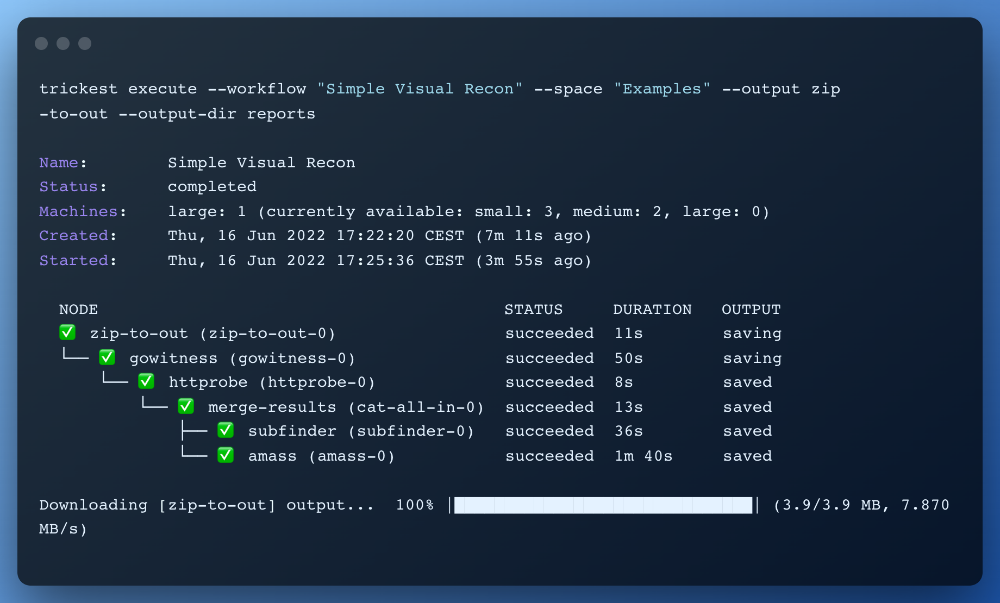

<h1 align="center">Trickest CLI<a href="https://twitter.com/intent/tweet?text=Trickest%20CLI%20-%20Execute%20workflows%20right%20from%20your%20terminal%20%40trick3st%0Ahttps%3A%2F%2Fgithub.com%2Ftrickest%2Ftrickest-cli"> </a></h1>

<h3 align="center">
Execute <a href=https://trickest.com>Trickest</a> workflows right from your terminal.
</h3>
<br>




# About

Trickest platform is an IDE tailored for bug bounty hunters, penetration testers, and SecOps teams to build and automate workflows from start to finish.

Current workflow categories are:

* Vulnerability Scanning
* Misconfiguration Scanning
* Container Security
* Web Application Scanning
* Asset Discovery
* Network Scanning
* Fuzzing
* Static Code Analysis
* ... and a lot more

[](https://trickest.io/auth/register)

# Store

[Trickest Store](https://trickest.io/dashboard/store) is a collection of public tools, Trickest scripts, and Trickest workflows available on the platform. More info can be found at [Trickest workflows repository](https://github.com/trickest/workflows) <- (Coming soon!)


# Installation

## Binary
Binaries are available in the [latest release](https://github.com/trickest/trickest-cli/releases/latest).

## Docker
```
docker run quay.io/trickest/trickest-cli
```

# Authentication

You can find your authentication token on the [Token](https://trickest.io/dashboard/settings/token) page inside the Trickest platform.

The authentication token can be provided through either a string flag `--token`, a file `--token-file`, or an environment variable `TRICKEST_TOKEN`.

The token supplied as `--token` or `--token-file` will take priority over the environment variable if both are present.

# Usage

## List command

#### All

Use the **list** command to list all of your spaces along with their descriptions.

```
trickest list
```

#### Spaces

Use the **list** command with the **--space** flag to list the content of your particular space; its projects and workflows, and their descriptions.

```
trickest list --space <space_name>
```

| Flag    | Type   | Default | Description                         |
|---------|--------|---------|-------------------------------------|
| --space | string | /       | The name of the space to be listed  |


#### Projects   

Use the **list** command with the **--project** option to list the content of your particular project; its workflows, along with their descriptions.

```
trickest list --project <project_name> --space <space_name>
```

| Flag      | Type   | Default | Description                                        |
|-----------|--------|---------|----------------------------------------------------|
| --project | string | /       | The name of the project to be listed.              |
| --space   | string | /       | The name of the space to which the project belongs |

##### Note: When passing values that have spaces in their names (e.g. "Alpine Testing"), they need to be double-quoted.

## GET

Use the **get** command to get details of a particular workflow (current status, node structure,  etc.).

```
trickest get --workflow <workflow_name> --space <space_name> [--watch]
```

| Flag        | Type     | Default | Description                                                            |
|-------------|----------|---------|------------------------------------------------------------------------|
| --space     | string   | /       | The name of the space to which the workflow/project belongs            |
| --project   | string   | /       | The name of the project to which the workflow belongs                  |
| --workflow  | string   | /       | The name of the workflow                                               |
| --run       | string   | /       | Get the status of a specific run                                       |
| --watch     | boolean  | /       | Option to track execution status in case workflow is in running state  |

##### If the supplied workflow has a running execution, you can jump in and watch it running with the `--watch` flag!

## Execute
Use the **execute** command to execute a particular workflow or tool.

```
trickest execute --workflow <workflow_or_tool_name> --space <space_name> --config <config_file_path> --set-name "New Name" [--watch]
```

| Flag             | Type    | Default | Description                                                                                                                                 |
|------------------|---------|---------|---------------------------------------------------------------------------------------------------------------------------------------------|
| --config         | file    | /       | YAML file for run configuration                                                                                                             |
| --workflow       | string  | /       | Workflow from the Store to be executed                                                                                                      |
| --max            | boolean | /       | Use maximum number of machines for workflow execution                                                                                       |
| --output         | string  | /       | A comma-separated list of nodes whose outputs should be downloaded when the execution is finished                                           |
| --output-all     | boolean | /       | Download all outputs when the execution is finished                                                                                         |
| --output-dir     | string  | .       | Path to the directory which should be used to store outputs                                                                                 |
| --show-params    | boolean | /       | Show parameters in the workflow tree                                                                                                        |
| --watch          | boolean | /       | Option to track execution status in case workflow is in running state                                                                       |
| --set-name       | string  | /       | Sets the new workflow name and will copy the workflow to space and project supplied                                                         |
| --ci             | boolean | false   | Enable CI mode (in-progress executions will be stopped when the CLI is forcefully stopped - if not set, you will be asked for confirmation) |
| --create-project | boolean | false   | If the project doesn't exist, create one using the project flag as its name (or workflow/tool name if project flag is not set)              |
| --machines       | string  | /       | Specify the number of machines (format: small-medium-large). Examples: 1-1-1, 0-0-3                                                         |

#### Provide parameters using **config.yaml** file

Use config.yaml file provided using `--config`` flag to specify:
- inputs values
- execution parallelism by machine type
- outputs to be downloaded.

The structure of you `config.yaml` file should look like this:
```
inputs:   # Input values for the particular workflow nodes.
  <node_name>.<input_name>: <input_value>
machines: # Machines configuration by type related to execution parallelisam.
  small:  <number>
  medium: <number>
  large:  <number>
outputs:  # List of nodes whose outputs will be downloaded.
  - <node_name>
```

You can use [example-config.yaml](example-config.yaml) as a starting point and edit it according to your workflow.

More example workflow **config.yaml** files can be found in the [Trickest Workflows repository](https://github.com/trickest/workflows). (Coming Soon :sparkles:)

### Continuous Integration 

You can find the Github Action for the `trickest-cli` at https://github.com/trickest/action and the Docker image at https://quay.io/trickest/trickest-cli.

The `execute` command can be used as part of a CI pipeline to execute your Trickest workflows whenever your code or infrastructure changes. Optionally, you can use the `--watch` command inside the action to watch a workflow's progress until it completes. 

The `--output`, `--output-all`, and `--output-dir` commands will fetch the outputs of one or more nodes to a particular directory, respectively.

Example GitHub action usage
```
    - name: Trickest Execute
      id: trickest
      uses: trickest/action@main
      env:
        TRICKEST_TOKEN: "${{ secrets.TRICKEST_TOKEN }}"
      with:
        workflow: "Example Workflow"
        space: "Example Space"
        project: "Example Project"
        watch: true
        output_dir: reports
        output_all: true
        output: "report"
```

## Output
Use the **output** command to download the outputs of your particular workflow execution(s) to your local environment.

```
trickest output --workflow <workflow_name> --space <space_name> [--nodes <comma_separated_list_of_nodes>] [--config <config_file_path>] [--runs <number>] [--output-dir <output_path_directory>]
```
| Flag       | Type    | Default | Description                                                                                                                        |
| ---------- | ------  | ------- | ---------------------------------------------------------------------------------------------------------------------------------- |
| --workflow | string  | /       | The name of the workflow.                                                                                                          |
| --space    | string  | /       | The name of the space to which workflow belongs                                                                                    |
| --config   | file    | /       | YAML file for run configuration                                                                                                    |
| --run      | string  | /       | Download output data of a specific run                                                                                             |
| --runs     | integer | 1       | The number of executions to be downloaded sorted by newest |
| --output-dir     | string | /       | Path to directory which should be used to store outputs |
| --nodes     | string | /       | A comma separated list of nodes whose outputs should be downloaded |
| --files     | string | /       | A comma-separated list of file names that should be downloaded from the selected node |

## Output Structure

When using the **output** command,  trickest-cli will keep the local directory/file structure the same as on the platform. All your spaces and projects will become directories with the appropriate outputs.

## Store

Use the **store** command to get more info about Trickest workflows and public tools available in the [Trickest Store](https://trickest.io/dashboard/store).

#### List
Use **store list** command to list all public tools & workflows available in the [store](https://trickest.io/dashboard/store), along with their descriptions.

```
trickest store list
```

#### Search
Use **store search** to search all Trickest tools & workflows available in the [store](https://trickest.io/dashboard/store), along with their descriptions.

```
trickest store search subdomain takeover
```

[](https://trickest.io/auth/register)

## Report Bugs / Feedback
We look forward to any feedback you want to share with us or if you're stuck with a problem you can contact us at [support@trickest.com](mailto:support@trickest.com).

You can also create an [Issue](https://github.com/trickest/trickest-cli/issues/new/choose) in the Github repository.
